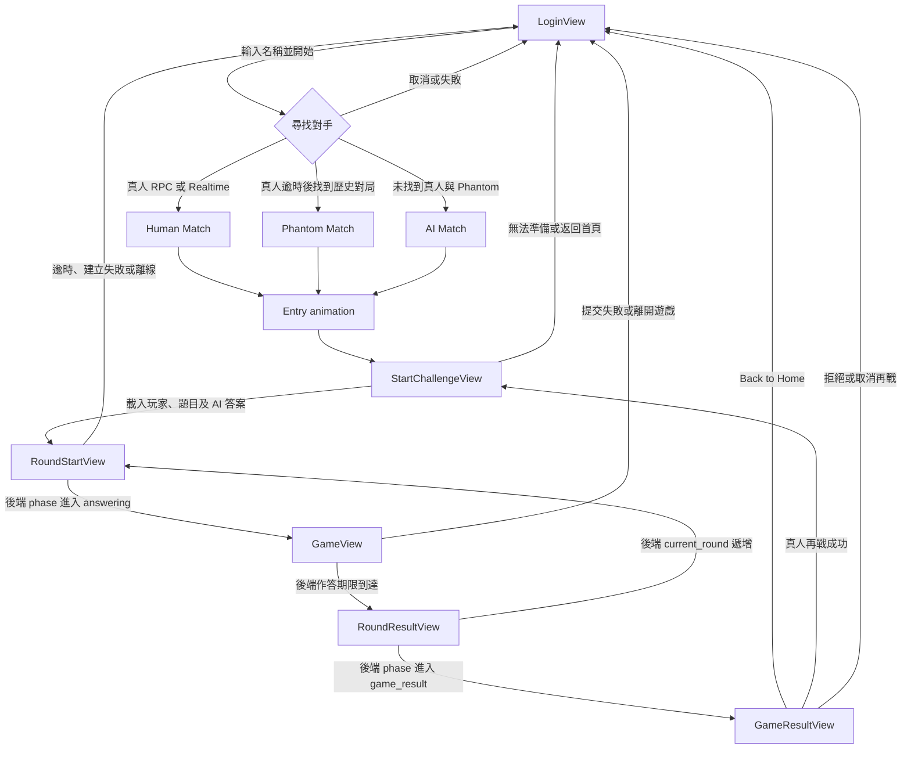
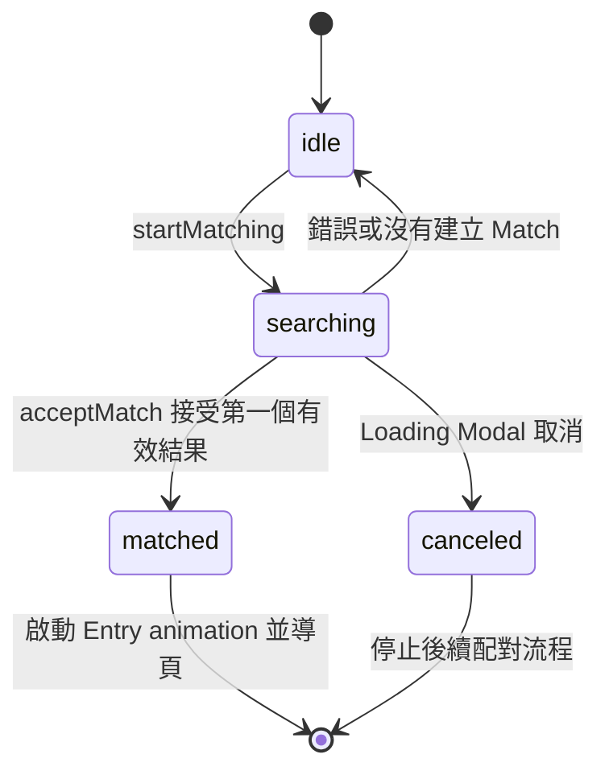
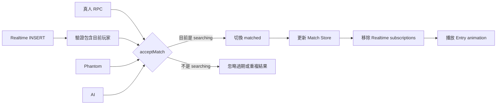
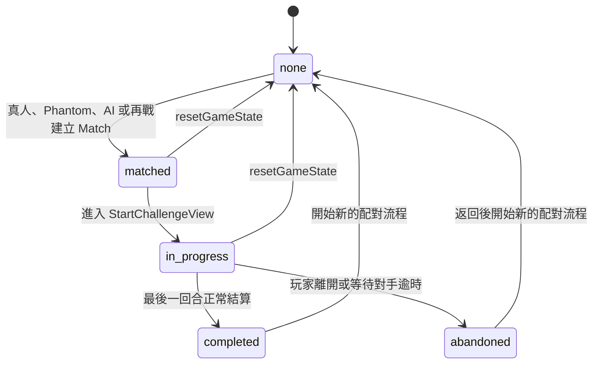
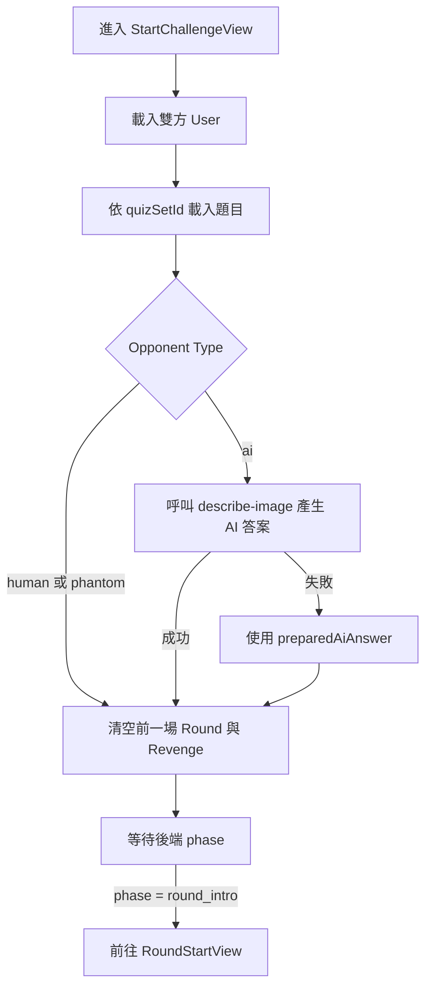
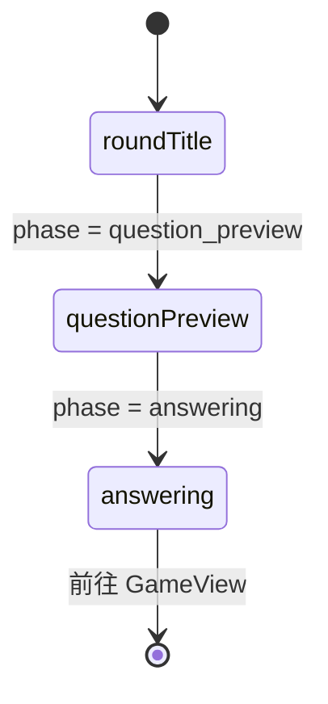
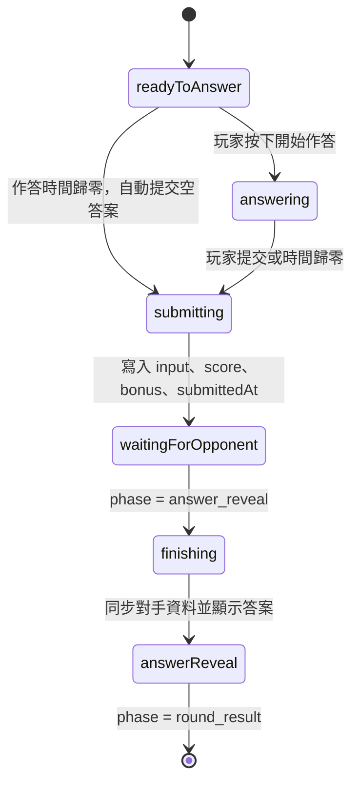
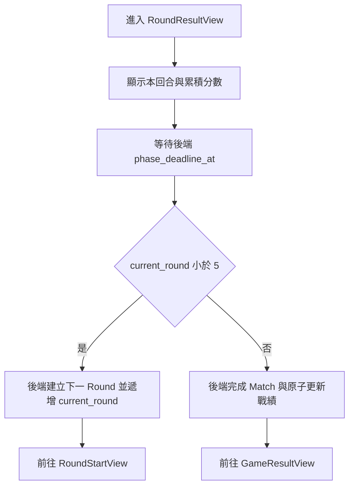
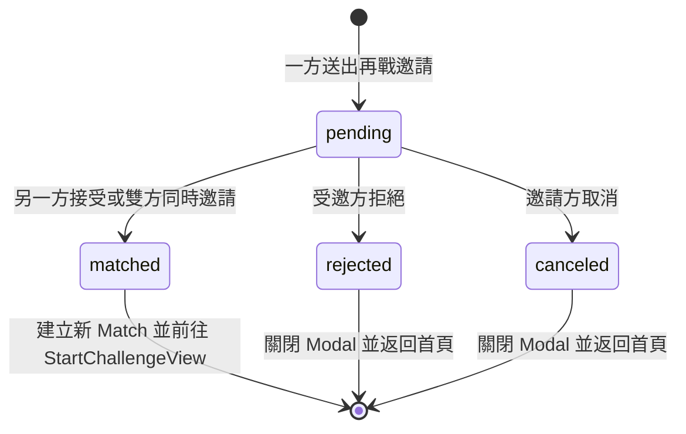
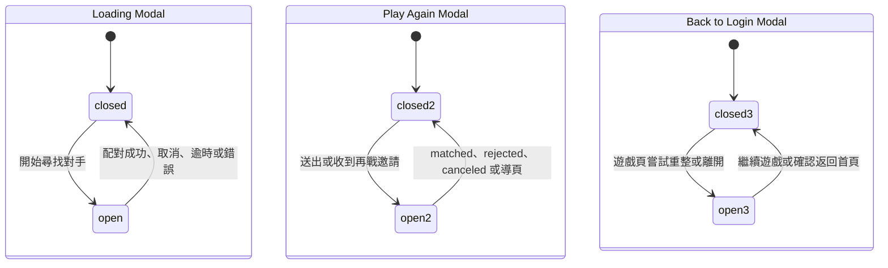

# 遊戲流程與狀態變化

本文記錄目前程式實際執行的頁面流程、配對來源與狀態變化。目錄與各層職責請參考 [`PROJECT_STRUCTURE.md`](./PROJECT_STRUCTURE.md)。

## 狀態的責任範圍

專案中有多種名稱相近、但生命週期不同的狀態，不應互相取代。

| 狀態 | 所在位置 | 生命週期與用途 |
| --- | --- | --- |
| `matchingState` | `useOpponentMatching.ts` | 單次「尋找對手」操作的暫時狀態，僅存在 Login 頁面 |
| `matchData.status` | `stores/match.ts` | 已建立 Match 的業務狀態，可跨頁面使用並同步至資料庫 |
| `matchData.phase` | `stores/match.ts` | Supabase 控制的遊戲階段，前端只能讀取並依此顯示或導頁 |
| `isMatchCanceled` | `stores/match.ts` | Loading Modal 發出的配對取消訊號 |
| Round fields | `stores/round.ts` | 每回合建立、作答、分數及提交時間 |
| `revengeInfo.status` | `stores/revenge.ts` | 再戰邀請的狀態 |
| Modal booleans | `stores/global.ts` | Loading、再戰及返回首頁 Modal 的顯示狀態 |

`matchingState = matched` 表示本次搜尋已接受一個結果；`matchData.status = matched` 表示資料庫中的 Match 已建立且等待開始。兩者語意與生命週期不同。

## 完整頁面流程



主要路由順序：

```text
/
→ /start-challenge/:matchId
→ /round-start/:matchId
→ /game/:matchId
→ /round-result/:matchId
→ 下一回合，或 /game-result/:matchId
```

## 1. 登入與配對

配對由 `useOpponentMatching.ts` 管理。開始前會重設上一場的 User、Match、Quiz、Round 與 Revenge store，建立或讀取本機使用者，再加入 `matching_pool`。

### 配對操作狀態



配對來源依序為：

1. 真人 RPC 輪詢 `match_users`，最多 10 秒。
2. `matches` Realtime INSERT；分別依 `player_one_id`、`player_two_id` 訂閱目前玩家。
3. 真人搜尋逾時後，以最多 10 秒尋找 `status = completed` 的歷史對局作為 Phantom，並以玩過的 `matchId` 排除重複候選。
4. 找不到 Phantom 時建立 AI 對手。

所有來源最後都必須經過 `acceptMatch()`：



因此 Realtime、RPC、Phantom 與 AI 即使接近同時完成，也只有第一個有效結果可以更新 Store 和觸發導頁。取消、錯誤、成功或 Login 元件卸載時都會清除 subscriptions。

## 2. Match 狀態

`matchData.status` 是已建立比賽的狀態，型別為：

```ts
type MatchStatus = 'none' | 'matched' | 'in_progress' | 'completed' | 'abandoned'
```



- `matched`：Match 已建立，尚未正式進行。
- `in_progress`：Start Challenge 開始時更新前端 Store 與資料庫。
- `completed`：最後一回合完成且比賽正常結算。
- `abandoned`：進行中離開，或等待另一位玩家建立 Round 逾時。
- `none`：目前沒有有效 Match。

### Match phase 與後端時間軸

```text
entry_banner
→ start_challenge
→ round_intro
→ question_preview
→ answer_preparing
→ answering
→ answer_reveal
→ round_result
→ 下一回合或 game_result
```

各階段時間集中在 `game_flow_settings`。`matches.phase_started_at` 與 `matches.phase_deadline_at` 保存資料庫絕對時間，Supabase Cron 每秒執行 `advance_due_matches()`；瀏覽器分頁被節流時，後端仍會建立回合、處理逾時空答案並推進 Match。

`entry_banner` 為 3.6 秒。進入 `start_challenge` 後，先顯示自己的玩家 Banner，
再顯示對手的玩家 Banner；對手 Banner 完整出現後停留 3 秒，才進入下一頁。

進入 `answer_preparing` 後會先 render Game；連續完成兩個 animation frame 後，前端只呼叫一次 `start_answering_after_render()`，由資料庫當下時間開始完整 10 秒 `answering`。若瀏覽器沒有執行，Cron 仍會在準備期限後自動開始，不會阻擋整場流程。

`useMatchFlowSync.ts` 只訂閱和讀取 Match，不呼叫 `advance_match_flow()`。遺漏 Realtime 時會在 deadline 後最多低頻重讀三次，並在分頁恢復可見時同步，避免形成無限 API 請求。

## 3. Start Challenge 準備流程

`useChallengePreparation.ts` 依序執行：



AI 對手不從 users table 讀取，而是在前端建立顯示用的 opponent info。Start Challenge 不再建立本機導頁 timer。

## 4. 回合準備

`RoundStartView` 以 `matchData.currentRound` 決定目前回合。Round 由後端進入 `round_intro` 時建立；前端只準備目前畫面所需的真人、Phantom 或 AI 對手資料。



不同對手的就緒條件：

| 對手類型 | Round 準備方式 |
| --- | --- |
| `human` | 後端同時建立雙方 Round；前端讀取兩筆資料 |
| `phantom` | 後端建立自己的 Round，前端從歷史 Round 建立對手顯示資料 |
| `ai` | 後端建立自己的 Round，前端建立 AI 顯示資料 |

三種對手流程在確認自己的 Round 已建立後，都會將資料寫入 Round Store。提交答案時會依 `round` 編號尋找目前資料；若本地資料尚未同步完成，會再向 Supabase 補查，避免缺少 `roundId`。

## 5. 作答與 Round 結束

`useRoundGameplay.ts` 管理倒數顯示、提交、對手提交與分數動畫；結果頁導覽由 Match phase 控制。



計分流程：

1. 呼叫 `/api/vectors` 取得標準答案與玩家答案的 embedding。
2. 使用 cosine similarity 計算分數。
3. API 失敗時改用 `calculateFallbackScore()`。
4. 依作答時間計算 bonus。
5. 更新 Round Store，再將提交資料寫入 Supabase。

對手答案來源：

- `human`：由 `rounds` UPDATE Realtime 更新對手 Round。
- `phantom`：依歷史 Round 的 `timeTakenMs` 延遲顯示。
- `ai`：使用預先產生的 AI 答案，隨機決定作答時間。

## 6. Round Result 與比賽結算



勝者由雙方 Round 的累積 `score + bonus` 比較；相同則 `winnerId` 為 `null`，畫面顯示 Tie。

## 7. 再戰流程

再戰只在 Human Match 顯示。狀態型別為：

```ts
type RevengeStatus = 'pending' | 'matched' | 'rejected' | 'canceled'
```



`useRevengeRealtime.ts` 依原 `match_id` 監聽 `revenge_requests` 的 INSERT 與 UPDATE：

- `pending`：開啟 Play Again Modal。
- `matched`：以 `revenge_id` 作為新 Match ID，進入新的 Start Challenge。
- `rejected`／`canceled`：關閉 Modal 並返回首頁。

## 8. 離開、重整與返回首頁

遊戲流程頁使用 `usePageGuard()`：

- 攔截瀏覽器返回。
- 在關閉分頁或重整時顯示瀏覽器提示。
- 攔截 F5、Ctrl+R、Cmd+R，並可開啟 Back to Login Modal。
- 程式內導航透過 `safePush()`／`safeReplace()` 取得一次性通行權。

使用者確認離開時，`App.vue` 會依目前 Match 狀態執行放棄處理、關閉 Modal，並返回 `/`。繼續遊戲則只關閉 Modal。

真人對戰使用 Supabase Presence 偵測掉線。新的 channel 必須先確認曾看過對手在線，才接受該對手的 `leave` 事件，避免舊工作階段的延遲事件造成誤判；對手離開後另有 3 秒重新連線寬限，仍未出現才中止比賽並顯示錯誤訊息。

## 9. 其他跨頁 Store 狀態

以下資料不是獨立的列舉狀態機，但會隨主流程建立、更新或清除。

| Store 狀態 | 建立或更新時機 | 清除時機 |
| --- | --- | --- |
| `userInfo` | Start Challenge 載入目前玩家資料 | 新配對開始時重設；確認返回首頁時清除 |
| `opponentInfo` | Start Challenge 載入真人／Phantom，或建立 AI 顯示資料 | 新配對開始時重設 |
| `myCurrentId` | Login 初始化或讀取本機使用者後 | User store 完整清除時 |
| `quizList` | Start Challenge 依 `quizSetId` 載入 | 新配對開始時清除 |
| `myRoundList` | 每次 Round Start 建立自己的 Round | 新 Match 的 Start Challenge 或新配對開始時清除 |
| `opponentRoundList` | Round Start 建立初始資料；Game 中由 Realtime 或模擬對手更新 | 新 Match 的 Start Challenge 或新配對開始時清除 |
| `phantomRoundList` | 配對階段選到 Phantom 時載入歷史回合 | 下一次 Phantom 配對時覆寫 |
| `aiResponseList` | Start Challenge 呼叫圖片描述 API 或採用 fallback 答案 | 下一次 AI Match 時覆寫 |
| `isWin` | 最後一回合正常結算時設定 | 下一場結算時覆寫 |

### Global Modal 狀態



Modal boolean 只控制顯示，不代表業務流程已成功。例如關閉 Loading Modal 不等於 Match 已建立，是否配對成功仍以 matchmaking 與 Match 狀態為準。

## 文件維護規則

下列改動必須同步更新本文：

- 新增、刪除或改名路由頁面。
- 修改配對來源、優先順序或取消行為。
- 修改 `MatchStatus`、`RevengeStatus` 或其他流程狀態。
- 修改回合建立、提交、結算或再戰條件。
- 新增會改變頁面導覽的 Realtime event。
